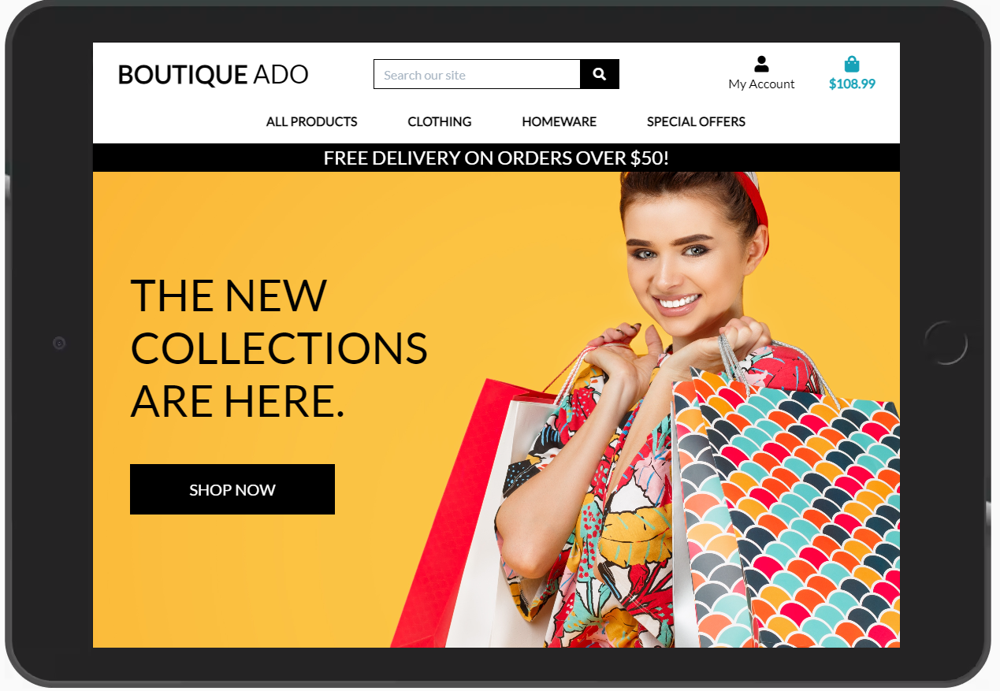

<h1 align="center">Boutique Ado E-Commerce Website</h1>

 

Boutique Ado is a fictitious e-commerce website built with the Django Python web framework. This project was completed as part of the
[Code Institute](https://codeinstitute.net/full-stack-software-development-diploma/) Full Stack Software Development Diploma.

 

**Languages and Technologies Utilised:**
* HTML
* CSS
* JavaScript
* Python
* [Bootstrap](https://getbootstrap.com/)
* [Django](https://www.djangoproject.com/)
* [Postgres](https://www.postgresql.org/) 
* [Stripe](https://stripe.com/en-ie)
